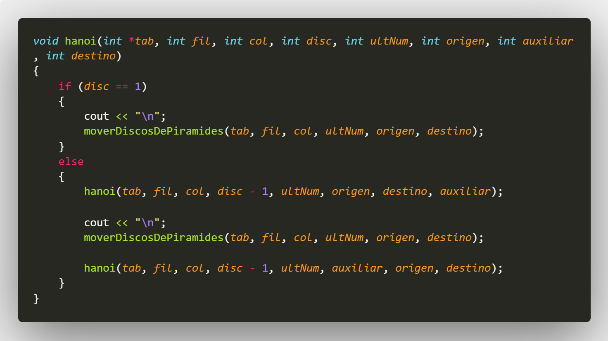
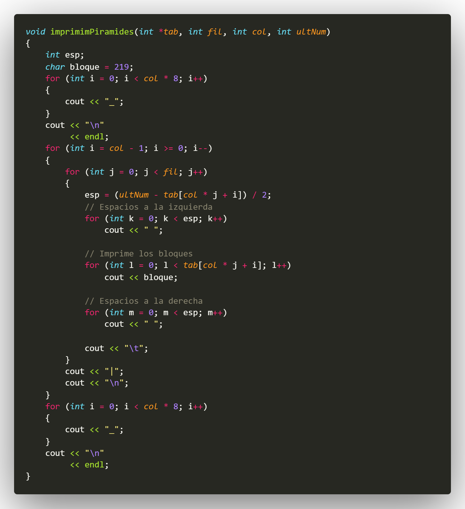
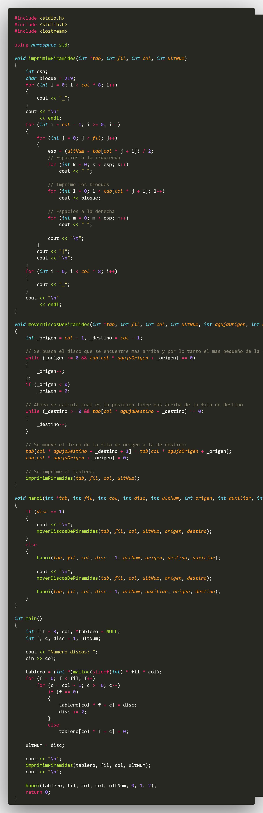

# C++_TDH_11811045_AndresNuila
## :copyright: Autor

- :camera: 

- :older_man: **Andrés Enrique Nuila Domínguez**
- :e-mail: enuila634@gmail.com
- :link: [github.com/enuila1325](https://github.com/enuila1325)
- :notes: [Emoji Cheat Sheet](https://www.webfx.com/tools/emoji-cheat-sheet/)
# Primera Parte

## Cpps

---
## Salidas

---

# Segunda Parte

## Cpps

---

---

---

---

---
## Salidas

---

.jpeg)

---

# Tercera Parte

## CPPs

---

---

## :computer: Código
- :blue_book: [Torres De Hanoi](https://github.com/enuila1325/C_TDH_11811045_AndresNuila)

#### Herramientas:
- :package: [Visual Studio Code](https://code.visualstudio.com/)
- :camera: [Polacode-2020 v0.5.2](https://github.com/jeff-hykin/polacode)